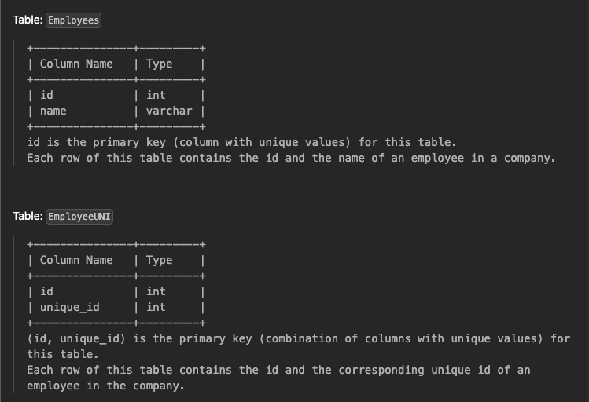

# 1378. Replace Employee ID With The Unique Identifier
```Easy```





Write a solution to show the unique ID of each user, If a user does not have a unique ID replace just show `null`.

Return the result table in any order.

The result format is in the following example.
